# Image_Object_detection_and_conversion


- Image Detector and Convertor App created using python's `Pillow`, `OpenCV`, `cvlib`, `numpy` and `streamlit` packages.
- Image Detector can perform Face Detection, Gender Detection and Object Detection using cvlib's `detect_face()`, `detect_gender()` and `detect_common_objects()`
- Image Filters can perform Gray Scale Effect, Pencil Drawing Effect, Sepia Effect, Summer Effect, Winter Effect, Invert Effect and also can alter Image's Contrast, Brightness and Blurriness
using `OpenCV` functions.

#### App Interface 👇:-
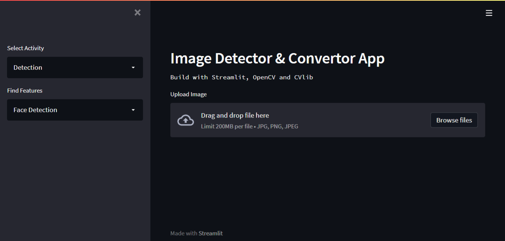

### Installation
To install all necessary requirement packages for the app 👇
```
pip install -r requirements.txt
```

#### Original Image:


#### Face Detection: 
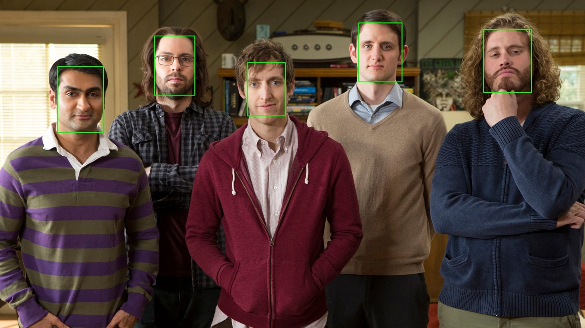

#### Gender Detection: 
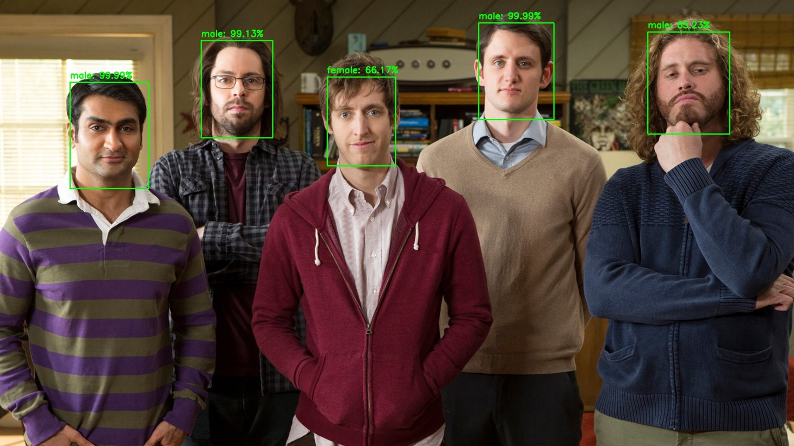

#### Object Detection:
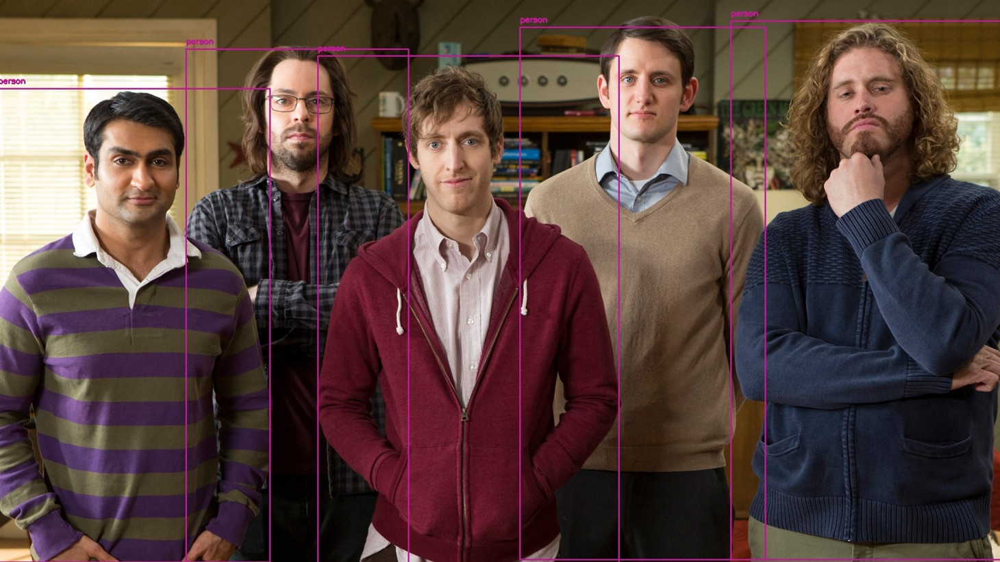

#### Brightness: 
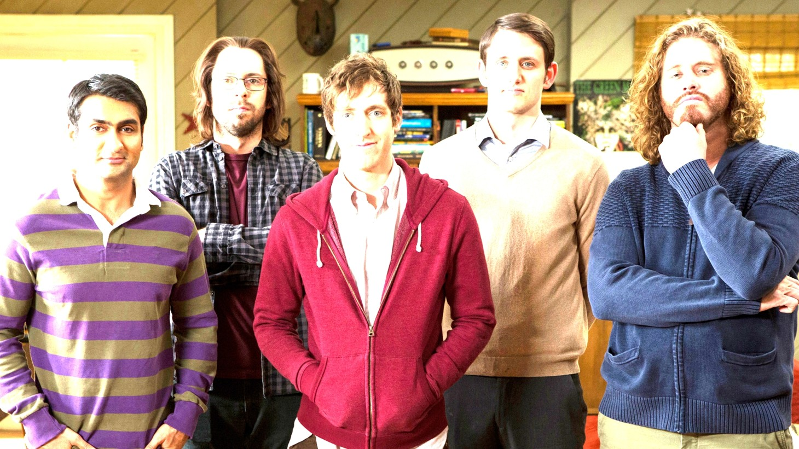

#### Blurring: 


#### Contrast: 
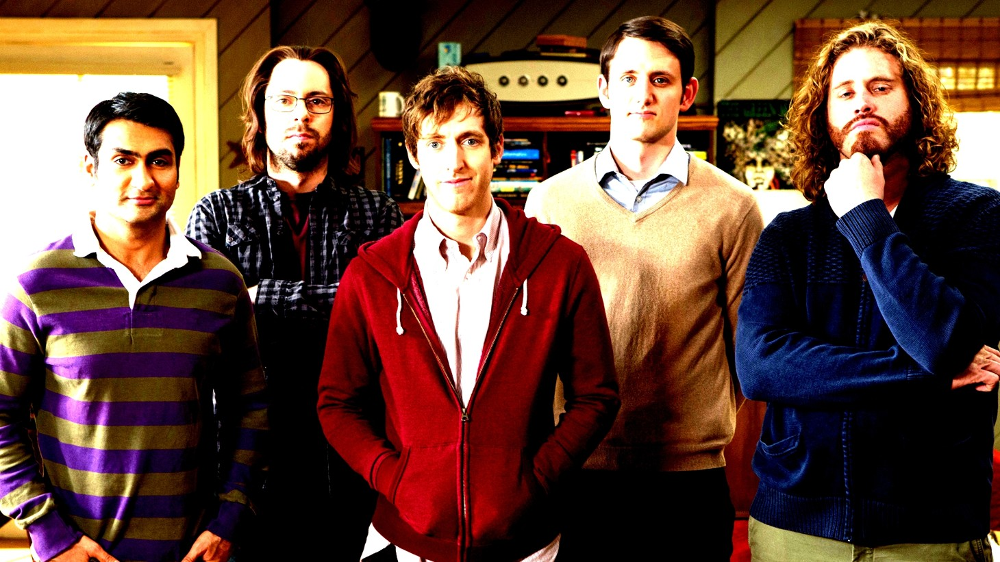

#### Gray-Scale Effect: 
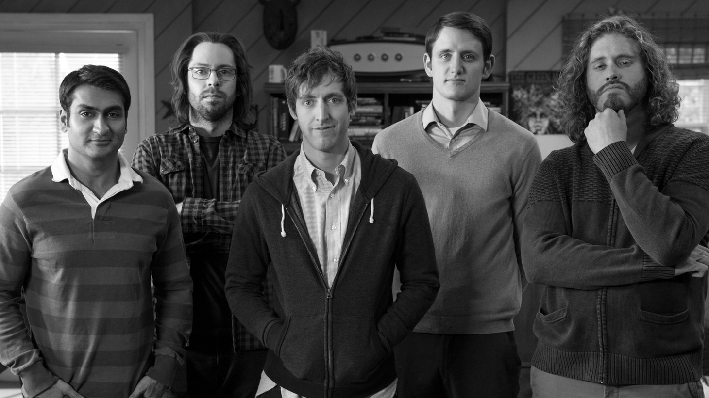

#### Pencil Drawing Effect: 
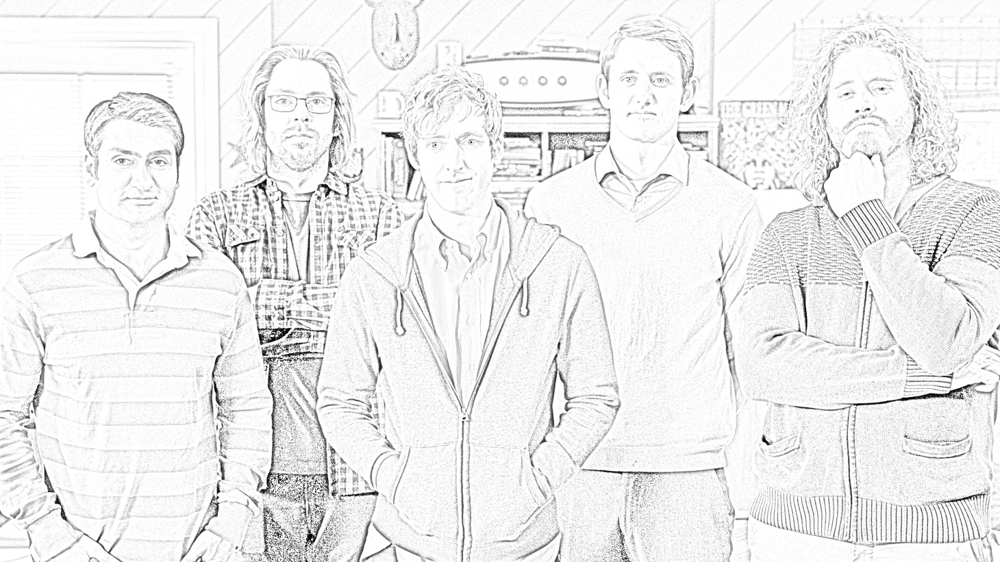

#### Sepia Effect:
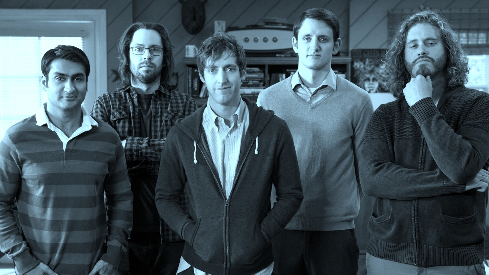

#### Invert Effect: 
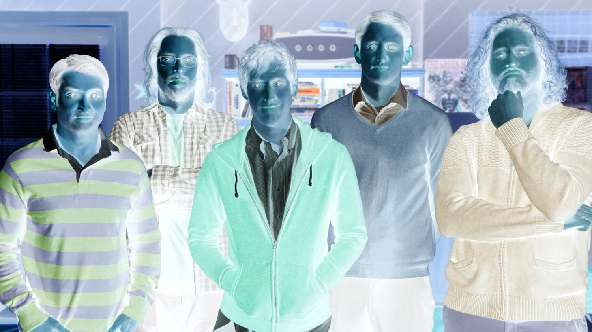

#### Summer Effect: 
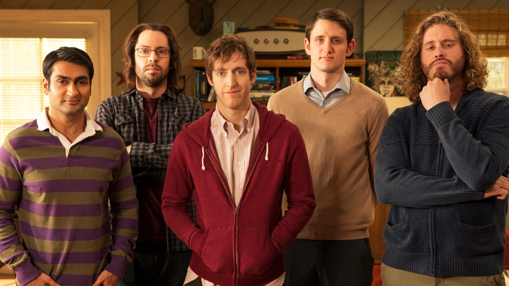

#### Winter Effect:
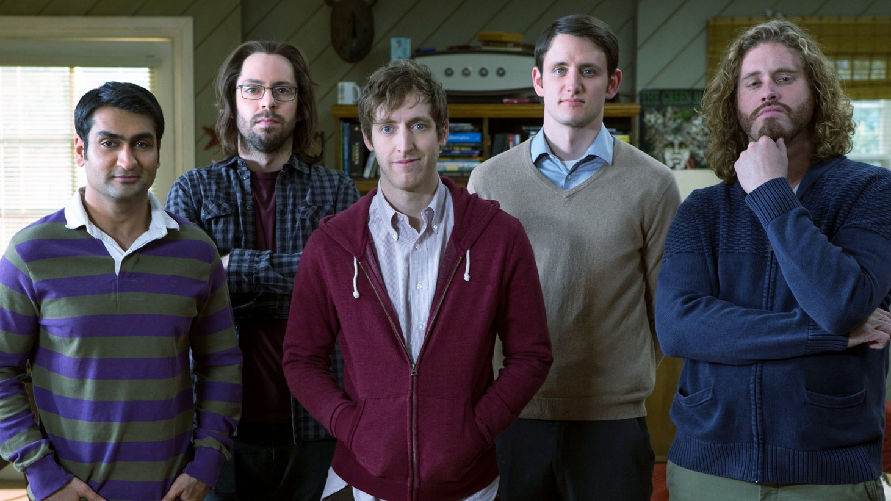
